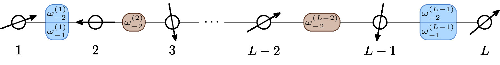

# Visualizing Spin Chains with TikZ



This repository contains a LaTeX file [diagram.tikz](diagram.tikz) with a generated picture for a spin chain.

In the diagram, a spin is represented by a circle with an (randomly directed) arrow, and the interactions between them are represented by rounded rectangles. The interactions for the odd and even bonds are different.

To compile the diagram, please use the following command:

```bash
lualatex diagram.tikz
```

A PDF file `diagram.pdf` will be generated.